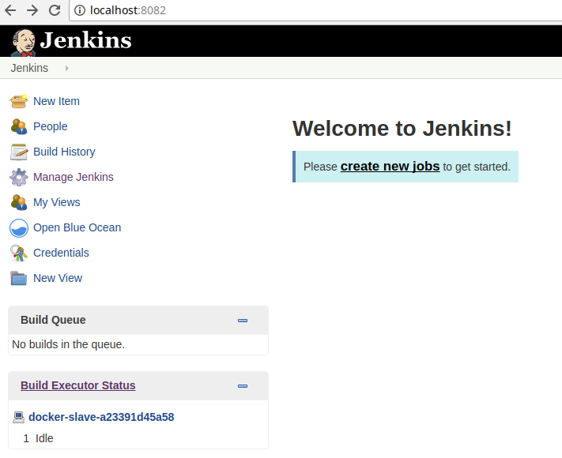

=== Setup local dev pipeline with Git & Jenkins ===

# Setup local git server

```
$ sudo adduser git
$ su git
$ cd
$ mkdir .ssh && chmod 700 .ssh
$ touch .ssh/authorized_keys && chmod 600 .ssh/authorized_keys

$ cd /opt/git
$ mkdir project.git
$ cd project.git
$ git init --bare

```

# Start Jenkins server and slaves

You can use docker images of jenkins from https://hub.docker.com/_/jenkins

First create shared folders for running containers:

```
mkdir ~/jenkins
sudo chown -R $USER:$USER ~/jenkins
mkdir ~/jenkins-slave1
sudo chown -R $USER:$USER ~/jenkins-slave1
```
Start master node: 
```
docker run -d --name jenkins -p 8082:8080 -p 50000:50000 \
           -v $HOME/jenkins:/var/jenkins_home \
           foxylion/jenkins

```
This will start jenkins and map conainer port `8080` to local port `8082` so you should login to jenkins at

[http://localhost:8082](http://localhost:8082)

It will also share jenkins installation folder from container to local `~/jenkins`

Admin credentials are: admin/admin

Start slave node: 

```
docker run -d --name jenkins-slave1 --restart=unless-stopped \
           -v /$HOME/jenkins-slave1:/home/jenkins \
           -v /var/run/docker.sock:/var/run/docker.sock \
           -v /$HOME/.m2:/home/jenkins/.m2 \
           -e JENKINS_URL=http://172.17.0.1:8082 \
           foxylion/jenkins-slave


```
It shares jenkins installation folder from container to local `~/jenkins-slave1`
The IP address `172.17.0.1` should be your docker host IP. 
On linux you can check it with `ifconfig` command and search for `docker0` interface.


## Setup ssh keys on jenkins slave

Get container id with

```
docker ps | grep jenkins-slave1
```

ssh to container

```
docker exec -it <container id> /bin/bash

```

Navigate to home folder and generate keys

```
cd
ssh-keygen -t rsa -b 4096
```
This will ask you some settings, accept defaults.

Then copy public key to clipboard

```
cat ~/.ssh/id_rsa.pub

```
Exit container


## Add public key of jenkins to git `authorized_keys`


ssh as git user on localhost

```

ssh git@localhost

```

Paste text from clipboard to authorized_keys file

```
vi ~/.ssh/authorized_keys

```

Now get back to jenkins slave container and test connection

```
docker exec -it <container id> /bin/bash
ssh git@172.17.0.1
```

The IP `172.17.0.1` is your docker host IP.
The command should print message like:

```
The authenticity of host '172.17.0.1 (172.17.0.1)' can't be established.
ECDSA key fingerprint is SHA256:9hFV9azxQdgsZGNz7+JEl4X1HhmrQQFZJgmJ7EarZM0.
Are you sure you want to continue connecting (yes/no)?

```

Confirm with yes. 
If you were authenticated as git user then everything is fine and it should work the same in jenkins job.

In case when SSH responds with

```
ssh: connect to host localhost port 22: Connection refused

```

Please try to uninstall and install ssh on localhost again, it usually solves problem on Debian based linux distros:

```
sudo apt-get remove openssh-client openssh-server

sudo apt-get install openssh-client openssh-server
```

# Push local repo to local git server

```
remote add local-git git@gitserver:/opt/git/project.git
push local-git master
```

# Create test job in Jenkins

Follow the steps below:


1. Login to jenkins at http://localhost:8082 with user `admin` and password `admin`



2. Create new build


3. Configure git 


4. Start the build and check it runs successfully


Now you can setup real build pipeline for local development.

Example if you have project with Maven build you can create a jenkins build which will run unit and integration tests and show code coverage.
See more how to create a pipeline with Jenkins pipeline plugin in [my blog post](https://dev.to/piczmar_0/jenkins-pipeline-for-remote-jacoco-test-coverage-9k5).

# Setting up Jenkins slave for running Maven with secured Nexus

In some cases you may have some custom Maven configuration on localhost, e.g. credentials to access Nexus server.
In this case using default Jenkins Docker image is not an option, unless you want to manually copy all the local setup to the container.

Here better solution is sharing local `.m2` folder to the container.

Below is a Docker run command for Jenkins slave which will allow you to accomplish this

```
docker run -d --name jenkins-slave1 --restart=unless-stopped \
           -v /$HOME/jenkins-slave1:/home/jenkins \
           -v /$HOME/.m2:/root/.m2 \
           -v /$HOME/.ssh:/root/.ssh \
           -v /var/run/docker.sock:/var/run/docker.sock \
           -e JENKINS_URL=http://172.17.0.1:8082 \
           foxylion/jenkins-slave
```
It shares also SSH credentials from you localhost so that Jenkins can authenticate to git repositories.

WARNING !! : at first run make sure to backup you local folders `/$HOME/.m2` and `/$HOME/.ssh` because if by any mistake the contaier already contains folders `/root/.m2` and `/root/.ssh` they will overwrite your local folders.

# Jenkins slave with Java Cryptography Extension (JCE) Unlimited Strength
If you have build which requires JCE then you can build Jenkins slave image from files in folder [jenkins-slave-jdk8-jce](jenkins-slave-jdk8-jce)
Use provided bash script to build image. Then you can start it with:

```
docker run -d --name jenkins-slave1 --restart=unless-stopped \
           -v /$HOME/jenkins-slave1:/home/jenkins \
           -v /$HOME/.m2:/root/.m2 \
           -v /$HOME/.ssh:/root/.ssh \
           -v /var/run/docker.sock:/var/run/docker.sock \
           -e JENKINS_URL=http://172.17.0.1:8082 \
           jenkins-slave

```

When you setup JDK in Jenkins use JAVA_HOME=/usr/lib/jvm/java-8-oracle

# References
 - https://git-scm.com/book/it/v2/Git-on-the-Server-Setting-Up-the-Server
 - https://help.github.com/articles/generating-a-new-ssh-key-and-adding-it-to-the-ssh-agent/
